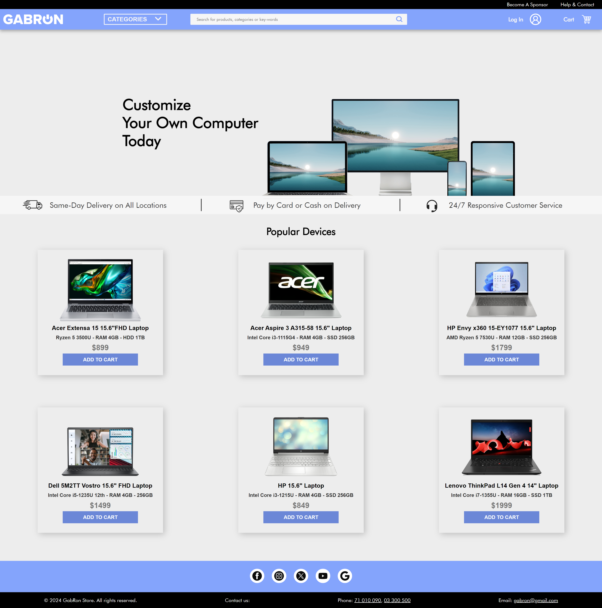

# E-commerce-Website-Front-Page

This repository contains the front page of an eCommerce website, designed to deliver a seamless and engaging user experience for online shoppers. The page is built with a focus on modern design principles, usability, and responsive layout, ensuring compatibility across various devices.

## Features

- **Hero Section:** Eye-catching banner or slideshow showcasing featured products or promotional offers.
- **Product Categories:** A grid or list of product categories, allowing users to easily navigate to their desired sections.
- **Best Sellers/Featured Products:** Highlighting top-selling or featured products with images, prices, and call-to-action buttons.
- **Search Bar:** A prominently placed search function for users to quickly find products.
- **User-Friendly Navigation:** A clear and intuitive menu structure for browsing different product categories and accessing the shopping cart, account, and other features.
- **Responsive Design:** Fully responsive layout, ensuring an optimal viewing experience on mobile, tablet, and desktop devices.
- **Footer Section:** Contains links to important pages like About Us, Contact, Privacy Policy, and social media handles.

## Technologies Used

- **HTML5** for semantic structure
- **CSS3** for styling and layout
- 
## How to View

1. Clone this repository:
   ```bash
   git clone https://github.com/ropandicate/E-Commerce-Website-Front-Page.git
